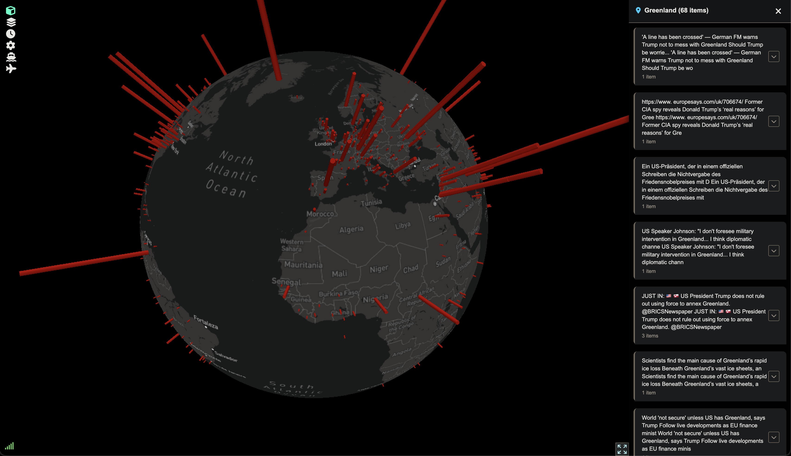

# NewsGlobe

A multi-source live world events aggregation system that collects, processes, and visualizes events from multiple data sources on an interactive map.

## Features

- **Multi-source ingestion**: RSS, Telegram, Mastodon, GDELT, GDACS, USGS
- **Real-time processing**: NLP/geocoding, event clustering, and streaming to frontend
- **Interactive map**: Web-based visualization with Cesium/Leaflet
- **Flight & maritime tracking**: ADSB aircraft and AIS vessel data integration

## Prerequisites

Before running News Globe, you'll need:

1. **API Keys:**
   - **Mapbox Access Token**: Required for map tiles. Get from [https://account.mapbox.com/access-tokens/](https://account.mapbox.com/access-tokens/)
   - **AIS Stream API Key**: Required for vessel tracking. Get from [https://aisstream.io/](https://aisstream.io/)

2. **System Requirements:**
   - **Docker & Docker Compose** (required for full system)
   - Python 3.x (for local development or debugging)
   - PostgreSQL with PostGIS (automatically provisioned via Docker)

## Quick Start

1. **Clone and configure:**
   ```bash
   git clone <repository-url>
   cd news-globe
   cp env.example .env
   # Edit .env with your API keys
   ```

2. **Start services with Docker Compose:**
   ```bash
   docker-compose up -d
   ```

3. **Or run locally for development:**
   ```bash
   pip install -r requirements.txt
   # Set environment variables or use .env file
   python main.py  # Automatically opens browser to http://localhost
   ```

4. **Access the application:**
   - Frontend: http://localhost (nginx on port 80)
   - API: http://localhost:8080/api (see [API.md](API.md) for documentation)

## Configuration

### Environment Variables

Copy `env.example` to `.env` and configure the following variables:

- `AISSTREAM_API_KEY`: Your AIS Stream API key from [https://aisstream.io/](https://aisstream.io/)
- `MAPBOX_TOKEN`: Your Mapbox access token from [https://account.mapbox.com/access-tokens/](https://account.mapbox.com/access-tokens/)
- `CESIUM_ION_TOKEN`: Your Cesium Ion API token from [https://cesium.com/ion/](https://cesium.com/ion/) (optional)
- `OPENWEATHERMAP_API_KEY`: Your OpenWeatherMap API key from [https://openweathermap.org/api](https://openweathermap.org/api) (optional)

The frontend will automatically load API tokens from the API at runtime.

## Data Pipeline

1. **Collection**:
   - Supervisor service orchestrates data collection from connectors (GDELT, GDACS, USGS, Telegram, Mastodon, RSS)
   - Raw data is converted to unified `IngestionRecord` format and stored in Memory Store

2. **Ingestion**:
   - Ingestion service continuously polls Memory Store for new records
   - Performs NLP-based geocoding for location extraction from unstructured text
   - Validates and normalizes data, stores in PostgreSQL with deduplication

3. **Clustering**:
   - Clustering service processes normalized events
   - Groups related events using spaCy sentence vectors and fuzzy string matching
   - Maintains cluster relationships and metadata in database

4. **Serving**:
   - API server provides REST endpoints for clusters, events, and real-time data
   - Frontend queries API via HTTP and displays events on interactive Cesium/Leaflet map
   - Proxy server handles WebSocket connections for real-time updates

## Architecture

- **Connectors**: Unified connectors for GDELT, GDACS, USGS, Telegram, Mastodon, RSS. Managed by the supervisor service.
- **Services**:
  - **API Server**: REST endpoints for data access and configuration
  - **Supervisor**: Orchestrates data collection from all connectors
  - **Ingestion Service**: Processes raw data with NLP/geocoding and deduplication
  - **Clustering Service**: Groups related events using spaCy vectors and fuzzy matching
  - **Memory Store**: In-memory data layer for fast data transfer between services
  - **Proxy Server**: Handles WebSocket connections and service routing
- **Frontend**: Static web app with interactive map visualization using Cesium/Leaflet
- **Database**: PostgreSQL with PostGIS for spatial data

## Requirements

- **Docker & Docker Compose** (recommended for production)
- **Python 3.x** (for local development)
- **PostgreSQL with PostGIS** (automatically handled by Docker)

## Development

### Testing

Run the test suite using Playwright for browser automation:
```bash
python tests/runner.py
```

### Frontend Debugging

For development debugging of frontend code:
```bash
python dev_scripts/frontend_debug.py
```

## Contributing

We welcome contributions! Please see [CONTRIBUTING.md](CONTRIBUTING.md) for detailed guidelines.

## License

This project is licensed under the MIT License - see the [LICENSE](LICENSE) file for details.
